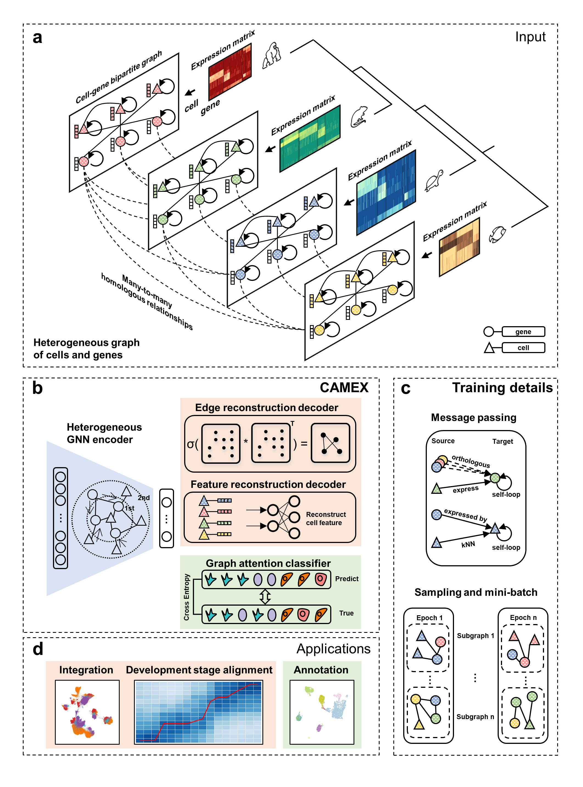

.. CAMEX documentation master file, created by
   sphinx-quickstart on Sun Dec 25 15:28:06 2022.
   You can adapt this file completely to your liking, but it should at least
   contain the root `toctree` directive.

CAMEX: Leveraging Heterogeneous Graph Neural Network for Multi-Species scRNA-seq data integration, alignment and annotation
====================================================================================================================================================

.. toctree::
   :maxdepth: 1
   
   Integrate_liver_across_4_species
   Integrate_testis_across_11_species
   Integrate_RNAseq_across_11_species
   integration_annotation_in_relatives_distant_species
   discovery_new_populations_markers
   
   
Overview of CAMEX
========================     

   
    
**a**. Single-cell RNA-seq (scRNA-seq) data from multiple species present remarkable opportunities to explore cellular origins and evolution. However, integrating and annotating scRNA-seq data across different species remains challenging due to the variations in sequencing techniques, ambiguity of homologous relationships, and limited biological knowledge. To tackle above challenges, we introduce CAMEX, a heterogeneous Graph Neural Network (GNN) tool which leverages many-to-many homologous relationships for integration, alignment and annotation of scRNA-seq data from multiple species. Notably, CAMEX outperforms state-of-the-art (SOTA) methods in terms of integration on various cross-species benchmarking datasets (ranging from one to eleven species). Besides, CAMEX facilitates the alignment of diverse species across different developmental stages, significantly enhancing our understanding of organ and organism origins. Furthermore, CAMEX makes it easier to detect species-specific cell types and marker genes through cell and gene embedding. In short, CAMEX holds the potential to provide invaluable insights into how evolutionary forces operate across different species at the single cell resolution.
   
Installation
============ 

It's recommended to create a separate conda environment for running CAMEX:

.. code-block:: python

   #create an environment called CAMEX
   conda create -n CAMEX python==3.9
   #activate your environment
   conda activate CAMEX

Install all the required packages.

.. code-block:: python

   conda install cudatoolkit=11.6 -c conda-forge
   pip install torch==1.13.1+cu116 torchvision==0.14.1+cu116 torchaudio==0.13.1 --extra-index-url https://download.pytorch.org/whl/cu116
   pip install dgl-cu116 -f https://data.dgl.ai/wheels/repo.html

The other versions of pytorch and dgl can be installed from
[torch](https://pytorch.org/) and [dgl](https://www.dgl.ai/pages/start.html).

Clone the repository.

.. code-block:: python

   git clone https://github.com/zhanglabtools/CAMEX.git
   cd CAMEX-main

	
.. code-block:: python

   cd CAMEX
   python setup.py bdist_wheel sdist
   cd dist
   pip install CAMEX-0.0.2.tar.gz

   
Citation
========
CAMEX: Leveraging Heterogeneous Graph Neural Network for Multi-Species scRNA-seq data integration, alignment and annotation